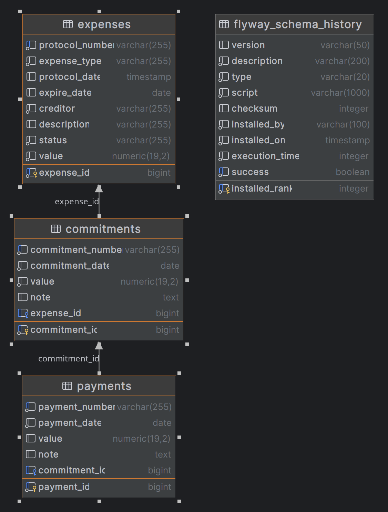

# SOP-Financeiro

API desenvolvida em Spring Boot para gerenciamento de **Despesas**, **Empenhos** e **Pagamentos**.  
Permite operações de **cadastro**, **edição**, **deleção** e **listagem** dessas entidades.

## ✨ Objetivo

Este projeto foi desenvolvido como parte de um processo seletivo e demonstra habilidades práticas com:
- Spring Boot
- Flyway
- Docker
- PostgreSQL

---

## 🚀 Tecnologias Utilizadas

- **Java 17**
- **Spring Boot**
- **Flyway** (migração e versionamento de banco de dados)
- **Docker e Docker Compose** (para criação automatizada do ambiente)
- **PostgreSQL**

---

## 🛠️ Como Executar o Projeto

### Pré-requisitos

- [Docker](https://www.docker.com/)
- [Docker Compose](https://docs.docker.com/compose/)
- [Java 17](https://adoptium.net/en-GB/temurin/releases/?version=17)

### Passo a passo

1. Clone o repositório:
   ```bash
   git clone https://github.com/seu-usuario/sop-financeiro.git
   cd sop-financeiro
2. Execute o projeto
   ```bash
   ./mvnw spring-boot:run

Nota: **O Flyway se encarregará de criar o banco de dados e aplicar as migrações iniciais automaticamente.**



📂 Estrutura do Projeto
 ```bash
sop-financeiro/
├── src/
│   └── main/
│       ├── java/                  # Código-fonte da aplicação
│       └── resources/
│           └── db/migration/     # Scripts SQL do Flyway
├── docker-compose.yaml           # Define o container PostgreSQL
├── pom.xml                       # Dependências Maven
```
## 🔗 Acesso à coleção

- Arquivo que pode ser importado no Postman, localizado no diretório raiz do projeto, **SOP_COLLECTION.postman_collection.json** ou também nas opções abaixo:

[](https://www.postman.com/deathglory/workspace/test/collection/8996336-ee4d80b9-3f3e-4e07-a242-505e7be39aa7?action=share&creator=8996336)

Ou acesse diretamente pelo link:  
🔗 [Coleção no Postman](https://www.postman.com/deathglory/workspace/test/collection/8996336-ee4d80b9-3f3e-4e07-a242-505e7be39aa7?action=share&creator=8996336)

---

📄 Licença
 - Este projeto é de uso livre.

👤 Autor
 - Berkson Ximenes Soares
 - GitHub: [Sop-Financeiro](https://github.com/berkson/sop-financeiro)
